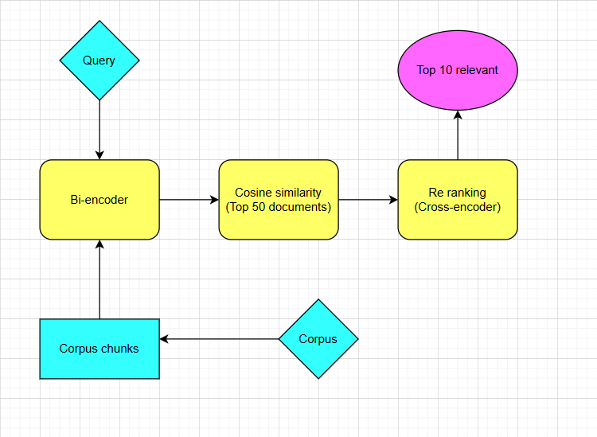

    <h1>Sentence-Level Chunking Analysis in Dual-Retrieval</h1>

## **Introduction**

Legal documents often contain lengthy contexts that exceed the processing capacity of transformer-based architectures such as bi-encoders and cross-encoders. To address this challenge, we adopt a chunking approach, where each document is divided into sentences. This repository aims to analyze the advantages and limitations of this method.

**Key contributions:**
* Applied bi-encoder to generate embeddings for each sentence, then calculated document embeddings via mean pooling. 
* Refined rankings with a cross-encoder by aggregating sentence scores through mean pooling.

## **Pipeline**
<a align="center">
    

## **Summary of results**

The full report can be found at report.pdf

### **Advantages**

This approach is particularly effective for long documents where the relevant answer appears at the end, as transformer-based architectures may truncate it without chunking.

### **Limitations**

Sentence-level chunking can lead to a loss of contextual understanding, sometimes resulting in worse performance than the general approach, especially when the relevant answer appears at the beginning of the document.

